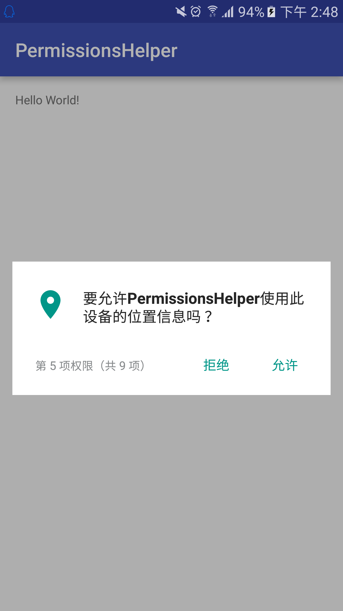

## Android 6.0 权限申请辅助 ----PermissionsHelper ##

> **项目地址:[https://github.com/didikee/PermissionsHelper](https://github.com/didikee/PermissionsHelper)**

> **Android 的危险权限分为9组.如下所示**

#### CALENDAR ####
 
	READ_CALENDAR
	WRITE_CALENDAR

#### CAMERA  ####

	CAMERA

#### CONTACTS ####

	READ_CONTACTS
	WRITE_CONTACTS
	GET_ACCOUNTS

#### LOCATION ####

	ACCESS_FINE_LOCATION
	ACCESS_COARSE_LOCATION

#### MICROPHONE ####

	RECORD_AUDIO

#### PHONE ####

	READ_PHONE_STATE
	CALL_PHONE
	READ_CALL_LOG
	WRITE_CALL_LOG
	ADD_VOICEMAIL
	USE_SIP
	PROCESS_OUTGOING_CALLS

#### SENSORS ####

	BODY_SENSORS

#### SMS ####

	SEND_SMS
	RECEIVE_SMS
	READ_SMS
	RECEIVE_WAP_PUSH
	RECEIVE_MMS

#### STORAGE ####

	READ_EXTERNAL_STORAGE
	WRITE_EXTERNAL_STORAGE

### 1. AndroidManifest.xml ###

> **9组 危险权限,按照你的项目需求申请,不要盲目,切勿贪婪.更不要偷懒复制粘贴**

	<!-- Dangerous Permissions start -->
    <!--PHONE-->
    <uses-permission android:name="android.permission.READ_PHONE_STATE"/>
    <uses-permission android:name="android.permission.CALL_PHONE"/>
    <uses-permission android:name="android.permission.READ_CALL_LOG"/>
    <uses-permission android:name="android.permission.ADD_VOICEMAIL"/>
    <uses-permission android:name="android.permission.WRITE_CALL_LOG"/>
    <uses-permission android:name="android.permission.USE_SIP"/>
    <uses-permission android:name="android.permission.PROCESS_OUTGOING_CALLS"/>
    <!--CALENDAR-->
    <uses-permission android:name="android.permission.READ_CALENDAR"/>
    <uses-permission android:name="android.permission.WRITE_CALENDAR"/>
    <!--CAMERA-->
    <uses-permission android:name="android.permission.CAMERA"/>
    <!--CONTACTS-->
    <uses-permission android:name="android.permission.READ_CONTACTS"/>
    <uses-permission android:name="android.permission.WRITE_CONTACTS"/>
    <uses-permission android:name="android.permission.GET_ACCOUNTS"/>
    <!--LOCATION-->
    <uses-permission android:name="android.permission.ACCESS_FINE_LOCATION"/>
    <uses-permission android:name="android.permission.ACCESS_COARSE_LOCATION"/>
    <!--MICROPHONE-->
    <uses-permission android:name="android.permission.RECORD_AUDIO"/>
    <!--SENSORS-->
    <uses-permission android:name="android.permission.BODY_SENSORS"/>
    <!--SMS-->
    <uses-permission android:name="android.permission.SEND_SMS"/>
    <uses-permission android:name="android.permission.RECEIVE_SMS"/>
    <uses-permission android:name="android.permission.READ_SMS"/>
    <uses-permission android:name="android.permission.RECEIVE_WAP_PUSH"/>
    <uses-permission android:name="android.permission.RECEIVE_MMS"/>
    <!--STORAGE-->
    <uses-permission android:name="android.permission.READ_EXTERNAL_STORAGE"/>
    <uses-permission android:name="android.permission.WRITE_EXTERNAL_STORAGE"/>
    <!-- Dangerous Permissions end -->

### 2. 在Activity中使用 ###

	public class PermissionsActivity extends AppCompatActivity {
	    // app所需要的全部危险权限
	    static final String[] PERMISSIONS = new String[]{
	            DangerousPermissions.CALENDAR,
	            DangerousPermissions.CAMERA,
	            DangerousPermissions.CONTACTS,
	            DangerousPermissions.LOCATION,
	            DangerousPermissions.MICROPHONE,
	            DangerousPermissions.PHONE,
	            DangerousPermissions.STORAGE,
	            DangerousPermissions.SENSORS,
	            DangerousPermissions.SMS
	    };
	    private PermissionsHelper permissionsHelper;
	
	    @Override
	    protected void onCreate(Bundle savedInstanceState) {
	        super.onCreate(savedInstanceState);
	        setContentView(R.layout.activity_permissions);
	        checkPermissions();
	    }
	    private void checkPermissions() {
	        permissionsHelper = new PermissionsHelper(this,PERMISSIONS);
	        if (permissionsHelper.checkAllPermissions(PERMISSIONS)){
	            permissionsHelper.onDestroy();
	            //doSomething
	        }else {
	            //申请权限
	            permissionsHelper.startRequestNeedPermissions();
	        }
	        permissionsHelper.setonAllNeedPermissionsGrantedListener(new PermissionsHelper.onAllNeedPermissionsGrantedListener() {
	
	
	            @Override
	            public void onAllNeedPermissionsGranted() {
	                Log.d("test","onAllNeedPermissionsGranted");
	            }
	
	            @Override
	            public void onPermissionsDenied() {
	                Log.d("test","onPermissionsDenied");
	            }
	        });
	    }
	
	    @Override
	    public void onRequestPermissionsResult(int requestCode, @NonNull String[] permissions,
	                                           @NonNull int[] grantResults) {
	        super.onRequestPermissionsResult(requestCode, permissions, grantResults);
	        permissionsHelper.onRequestPermissionsResult(requestCode, permissions, grantResults);
	    }
	 	@Override
	    protected void onActivityResult(int requestCode, int resultCode, Intent data) {
	        super.onActivityResult(requestCode, resultCode, data);
	        permissionsHelper.onActivityResult(requestCode, resultCode, data);
	    }
	}

### 9 组危险权限 (Dangerous Permissions) ###

	public final class DangerousPermissions {
	    /**
	     * Google doc:
	     * If an app requests a dangerous permission listed in its manifest,
	     * and the app already has another dangerous permission in the same
	     * permission group, the system immediately grants the permission
	     * without any interaction with the user. For example, if an app had
	     * previously requested and been granted the READ_CONTACTS permission,
	     * and it then requests WRITE_CONTACTS, the system immediately grants that permission.
	     */
	
	    /*
	    *   permission group : PHONE
	    * 	READ_PHONE_STATE
		*   CALL_PHONE
		*   READ_CALL_LOG
		*   WRITE_CALL_LOG
		*   ADD_VOICEMAIL
		*   USE_SIP
		*   PROCESS_OUTGOING_CALLS
	    */
	    public static final String PHONE= Manifest.permission.READ_PHONE_STATE;
	
	    /**
	     *  permission group : CALENDAR
	     *  READ_CALENDAR
	     *  WRITE_CALENDAR
	     */
	    public static final String CALENDAR= Manifest.permission.READ_CALENDAR;
	
	    /**
	     *  permission group : CAMERA
	     *  CAMERA
	     */
	    public static final String CAMERA= Manifest.permission.CAMERA;
	
	    /**
	     *  permission group : CONTACTS
	     *  READ_CONTACTS
	     *  WRITE_CONTACTS
	     *  GET_ACCOUNTS
	     */
	    public static final String CONTACTS= Manifest.permission.READ_CONTACTS;
	
	    /**
	     *  permission group : LOCATION
	     *  ACCESS_FINE_LOCATION
	     *  ACCESS_COARSE_LOCATION
	     */
	    public static final String LOCATION= Manifest.permission.ACCESS_FINE_LOCATION;
	
	    /**
	     *  permission group : MICROPHONE
	     *  RECORD_AUDIO
	     */
	    public static final String MICROPHONE= Manifest.permission.RECORD_AUDIO;
	
	    /**
	     *  permission group : SENSORS
	     *  BODY_SENSORS
	     */
	    public static final String SENSORS= Manifest.permission.BODY_SENSORS;
	
	    /**
	     *  permission group : SMS
	     *  SEND_SMS
	     *  RECEIVE_SMS
	     *  READ_SMS
	     *  RECEIVE_WAP_PUSH
	     *  RECEIVE_MMS
	     */
	    public static final String SMS= Manifest.permission.SEND_SMS;
	
	    /**
	     *  permission group : STORAGE
	     *  READ_EXTERNAL_STORAGE
	     *  WRITE_EXTERNAL_STORAGE
	     */
	    public static final String STORAGE= Manifest.permission.WRITE_EXTERNAL_STORAGE;
	
	}

### 运行时 申请权限 图示 ###
